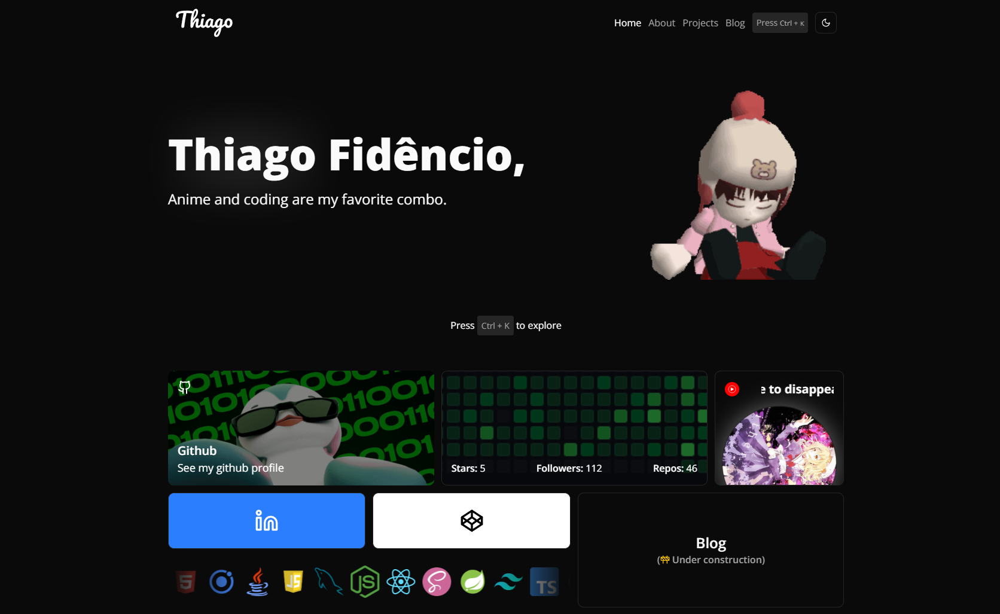

# 💻 Thiago's Portfolio

## 🌟 Overview

**Hello World!**

Here is a digital space where I showcase what I can do! Here, you'll find my projects, the technologies I use, and a bit about my journey as a developer. Built with lots of code, coffee, lofi, and a constant drive to learn more. Feel free to explore! 😃💻

[Deployment](https://thiagof.vercel.app/)

## 🛠️ Technologies Used

This portfolio is built using modern web technologies to ensure performance, scalability, and a great user experience.

- **Front-end**: HTML, TypeScript, Nexjs, Tailwind CSS, ShadCN
<!-- - **Back-end**: Node.js, Express, NestJS, Java, Spring Boot
- **Databases**: MySQL, Firebase Firestore
- **DevOps & Tools**: Docker, Git, CI/CD, Jest, Vite -->

## 🚀 Future Features

The portfolio is constantly evolving. Here are some upcoming features:

- 🌎 Multi-language support
- 🎨 Enhanced UI/UX design updates
- 📱 Improved mobile responsiveness
- ⚡ Performance optimizations
- 📝 Blog section for technical articles

## 📞 Contact

If you have any questions or would like to collaborate, feel free to reach out:

- **Email**: [ythiagohcfidenciol@gmail.com](mailto:ythiagohcfidencio@gmail.com)
- **LinkedIn**: [linkedin.com/in/ythiago03](https://www.linkedin.com/in/ythiago03/)
- **GitHub**: [github.com/ythiago03](https://github.com/ythiago03)

Thank you for visiting! 🚀
